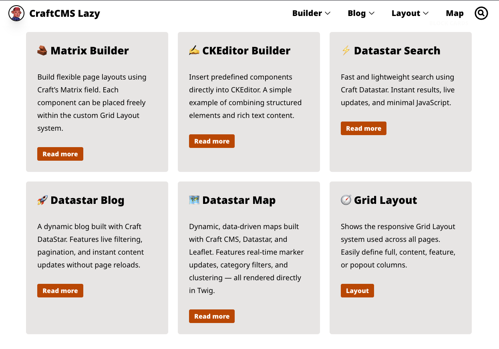

# 🚀 CraftCMS Lazy Starter Kit

A modern, production-ready Craft CMS Starter Kit with Vite, Tailwind, Vue Web Components, Datastar, GraphQL and DDEV —
perfect for agencies and freelancers who want to build clean and fast Craft sites.

---

## 🧩 Overview

This starter kit helps developers quickly spin up clean and maintainable Craft CMS projects.  
It includes ready-made examples for Matrix Blocks, CKEditor integration, a Datastar-powered Search page, and both
Datastar- and Vue-based blog listings.

This boilerplate demonstrates a **clean, scalable, and modern Craft CMS setup** — perfect for **agencies, freelancers**,
and **developers** who want a production-ready foundation for new Craft projects.

### Live Demo: [craftcms-lazy-starter-kit.webworker.me](https://craftcms-lazy-starter-kit.webworker.me)

---

## 🧠 Built with Modern Tools

- ⚙️ **Craft CMS 5** – latest version with flexible content modeling
- ⚡ **Vite** – fast bundling and instant reloads
- 🧩 **DDEV** – reproducible local development environment
- 🚀 **Datastar** – lightweight, reactive frontend for dynamic UIs
- 🧱 **Vue 3 (Web Components)** – progressive enhancement with custom elements
- 🔗 **GraphQL** – structured data fetching directly from Craft
- 🎨 **Tailwind CSS v4** – utility-first styling with CSS variables
- 🎞️ **Anime.js** – smooth element animations and scroll-based transitions
- 🗃️ **Craft eagerly() + render()** – optimized queries, automatic block templates, and smart caching
- 🧾 **SEO-Ready JSON-LD Organization Schema** – structured data for Google Rich Results
- 🔍 **SEO Meta, Open Graph & Sitemap** – via SEOMate
- 🔌 **Plugins:** CKEditor, Datastar, Image Resizer, SEOMate, Vite

---



### 🤝 Open Source

This boilerplate is open for everyone — built by [Andi Grether](https://webworker.me) to help developers build faster,
cleaner, and more maintainable Craft CMS sites.

## ⚙️ Quick Start

Get up and running with **CraftCMS Lazy** in just a few steps.

```bash
# Clone the repository
git clone https://github.com/handplant/craftcms-lazy-starter-kit
cd craftcms-lazy-starter-kit

# Copy the environment file
cp .env.example .env

# Start DDEV and install dependencies
ddev start
ddev composer install
ddev npm install

# Import the included demo database
ddev import-db --file=demo.sql

# Admin Login
User: admin  
Password: superuser
```

Then open your site at: 👉 https://craftcms-lazy.ddev.site

---

💡 If you don’t import the demo database, you’ll start with a clean _Craft CMS Lazy_ installation.

```
ddev craft install
```

### 🧰 Development

Start the local dev server with Vite:

```bash
ddev node run dev
```

### 🏗️ Production Build

When you’re ready to build the production assets:

```bash
ddev node run build
```

This will generate the optimized files in the web/dist/ directory and update the manifest.json for Craft’s Vite
integration.

### 🖼️ Demo Assets

This repo includes `/uploads` in version control so the starter kit works out of the box.  
In production, these should be added to `.gitignore`.
